# Executive Function App
> Generated by [`prisma-markdown`](https://github.com/samchon/prisma-markdown)

- [default](#default)

## default

```mermaid
erDiagram
"Account" {
  String id PK
  String userId FK
  String type
  String provider
  String providerAccountId
  String refresh_token "nullable"
  String access_token "nullable"
  Int expires_at "nullable"
  String token_type "nullable"
  String scope "nullable"
  String id_token "nullable"
  String session_state "nullable"
}
"Session" {
  String id PK
  String sessionToken UK
  DateTime expires
  String userId FK
}
"User" {
  String id PK
  String name "nullable"
  String email UK "nullable"
  DateTime emailVerified "nullable"
  String image "nullable"
  Int personId FK "nullable"
}
"VerificationToken" {
  String identifier
  String token UK
  DateTime expires
}
"Person" {
  Int id PK
  String username "nullable"
  String bio "nullable"
}
"ProjectTemplate" {
  Int id PK
  String name UK
  String info "nullable"
  String completionRequirements "nullable"
  String image "nullable"
  String color "nullable"
  String links
  DateTime createdAt
  DateTime updatedAt
}
"PersonsToProjectTemplates" {
  Int personId FK
  Int projectId FK
}
"Project" {
  Int id PK
  String name
  String info "nullable"
  String color "nullable"
  String links
  String problemStatement "nullable"
  String completionRequirements "nullable"
  String completionReview "nullable"
  Int templateId FK "nullable"
  Boolean public
  DateTime publicAt "nullable"
  DateTime createdAt
  DateTime updatedAt
  DateTime startAt "nullable"
  DateTime startedAt "nullable"
  DateTime dueAt "nullable"
  DateTime endedAt "nullable"
}
"PersonsToProjects" {
  Int personId FK
  Int projectId FK
  DateTime volunteerDate
}
"TaskTemplate" {
  Int id PK
  String name UK
  String info "nullable"
  String completionRequirements "nullable"
  String color "nullable"
  String links
  Json schedule
  DateTime createdAt
  DateTime updatedAt
}
"TaskTemplateLink" {
  Int precursorId FK
  Int successorId FK
  LinkType linkType
}
"PersonsToTaskTemplates" {
  Int personId FK
  Int taskId FK
}
"Task" {
  Int id PK
  String name
  String info "nullable"
  String completionReview "nullable"
  String color "nullable"
  String links
  Int templateId FK "nullable"
  Int personId FK "nullable"
  Boolean public
  DateTime publicAt "nullable"
  DateTime createdAt
  DateTime updatedAt
  DateTime startAt "nullable"
  DateTime startedAt "nullable"
  DateTime dueAt "nullable"
  DateTime endedAt "nullable"
}
"TaskLink" {
  Int precursorId FK
  Int successorId FK
  LinkType linkType
}
"TaskWork" {
  Int id PK
  Int taskId FK
  String notes "nullable"
  Int personId FK
  DateTime startedAt "nullable"
  DateTime endedAt "nullable"
}
"ProjectTemplatesToTaskTemplates" {
  Int projectId FK
  Int taskId FK
  Int count
  Json schedule
  String problemSolvency "nullable"
}
"ProjectsToTasks" {
  Int projectId FK
  Int taskId FK
  String problemSolvency "nullable"
}
"Tag" {
  Int id PK
  String name UK
  String info "nullable"
  Boolean nsfw
  String color "nullable"
}
"PrivateTag" {
  Int id PK
  String name
  String info "nullable"
  Boolean nsfw
  String color "nullable"
  Int personId FK
}
"PersonsToTags" {
  Int followerId FK
  Int tagId FK
}
"ProjectTemplatesToTags" {
  Int projectId FK
  Int tagId FK
  Int taggerId FK
}
"PrivateTagsToProjectTemplates" {
  Int projectId FK
  Int privateTagId FK
}
"TagsToTaskTemplates" {
  Int taskId FK
  Int tagId FK
  Int taggerId FK
}
"PrivateTagsToTaskTemplates" {
  Int taskId FK
  Int tagId FK
}
"ProjectsToTags" {
  Int tagId FK
  Int projectId FK
}
"PrivateTagsToProjects" {
  Int tagId FK
  Int projectId FK
}
"TagsToTasks" {
  Int tagId FK
  Int taskId FK
}
"PrivateTagsToTasks" {
  Int tagId FK
  Int taskId FK
}
"Energy" {
  Int id PK
  String name
  String unit
  String info "nullable"
  String color "nullable"
  String music
}
"PrivateEnergy" {
  Int personId FK
  Int id PK
  String name
  String unit
  String info "nullable"
  String color "nullable"
  String music
}
"Context" {
  Int id PK
  String name
}
"EnergiesToProjectTemplates" {
  Int projectId FK
  Int energyId FK
  String links
  String info "nullable"
}
"PrivateEnergiesToProjectTemplates" {
  Int projectId FK
  Int energyId FK
}
"EnergiesToProjects" {
  Int projectId FK
  Int energyId FK
  String info "nullable"
  String links
}
"PrivateEnergiesToProjects" {
  Int projectId FK
  Int energyId FK
  String notes "nullable"
}
"EnergiesToTaskTemplates" {
  Int taskId FK
  Int energyId FK
  String info "nullable"
  String links
}
"PrivateEnergiesToTaskTemplates" {
  Int taskId FK
  Int energyId FK
}
"EnergiesToTasks" {
  Int energyId FK
  Int taskId FK
  String notes "nullable"
}
"PrivateEnergiesToTasks" {
  Int energyId FK
  Int taskId FK
  String notes "nullable"
}
"EnergiesToTags" {
  Int energyId FK
  Int tagId FK
  Int taggerId FK
  String info "nullable"
}
"EnergiesToPrivateTags" {
  Int energyId FK
  Int tagId FK
  String notes "nullable"
}
"PrivateEnergiesToPrivateTags" {
  Int energyId FK
  Int tagId FK
}
"PrivateEnergiesToTags" {
  Int energyId FK
  Int tagId FK
}
"EnergiesToPersons" {
  Int personId FK
  Int energyId FK
}
"EnergyMeasurement" {
  Int id PK
  DateTime date
  Decimal measurement
  Int personId FK
  Int energyId
}
"EnergiesToTaskWorks" {
  Int energyId FK
  Int workId FK
  Decimal startingValue
  Decimal endingValue
}
"PrivateEnergiesToTaskWorks" {
  Int energyId FK
  Int workId FK
  Decimal startingValue
  Decimal endingValue
}
"Priority" {
  Int id PK
  Int personId FK
  String info "nullable"
  String color "nullable"
}
"PrioritiesToTasks" {
  Int priorityId FK
  Int taskId FK
  String notes "nullable"
}
"PrioritiesToProjects" {
  Int projectId FK
  Int priorityId FK
  Decimal weight "nullable"
  String notes "nullable"
}
"PrioritiesToSkills" {
  Int priorityId FK
  Int skillId FK
  String notes "nullable"
}
"PrioritiesToSkillPaths" {
  Int skillPathId FK
  Int priorityId FK
  String notes "nullable"
}
"PrioritiesToTags" {
  Int tagId FK
  Int priorityId FK
  String notes "nullable"
}
"PrioritiesToPrivateTags" {
  Int tagId FK
  Int priorityId FK
  String notes "nullable"
}
"SkillPath" {
  Int id PK
  String name
  String info "nullable"
}
"PersonsToSkillPaths" {
  Int personId FK
  Int skillId FK
  String notes "nullable"
}
"SkillPathsToTags" {
  Int skillId FK
  Int tagId FK
  Int taggerId FK
}
"Skill" {
  Int id PK
  String name
  String info "nullable"
}
"SkillLink" {
  Int precursorId FK
  Int successorId FK
  String info "nullable"
  Decimal hourGate
}
"SkillsToSkillPaths" {
  Int skillId FK
  Int skillPathId FK
}
"PersonsToSkills" {
  Int personId FK
  Int skillId FK
}
"SkillsToTags" {
  Int skillId FK
  Int tagId FK
  Int taggerId FK
}
"SkillsToTaskTemplates" {
  Int taskId FK
  Int skillId FK
}
"SkillsToTasks" {
  Int taskId FK
  Int skillId FK
}
"EnergiesToSkills" {
  Int skillId FK
  Int energyId FK
  String notes "nullable"
}
"PrivateEnergiesToSkills" {
  Int skillId FK
  Int energyId FK
  String notes "nullable"
}
"Account" }o--|| "User" : user
"Session" }o--|| "User" : user
"User" |o--o| "Person" : person
"PersonsToProjectTemplates" }o--|| "Person" : person
"PersonsToProjectTemplates" }o--|| "ProjectTemplate" : project
"Project" }o--o| "ProjectTemplate" : template
"PersonsToProjects" }o--|| "Person" : person
"PersonsToProjects" }o--|| "Project" : project
"TaskTemplateLink" }o--|| "TaskTemplate" : precursor
"TaskTemplateLink" }o--|| "TaskTemplate" : successor
"PersonsToTaskTemplates" }o--|| "Person" : person
"PersonsToTaskTemplates" }o--|| "TaskTemplate" : task
"Task" }o--o| "TaskTemplate" : template
"Task" }o--o| "Person" : person
"TaskLink" }o--|| "Task" : precursor
"TaskLink" }o--|| "Task" : successor
"TaskWork" }o--|| "Task" : task
"TaskWork" }o--|| "Person" : person
"ProjectTemplatesToTaskTemplates" }o--|| "ProjectTemplate" : project
"ProjectTemplatesToTaskTemplates" }o--|| "TaskTemplate" : task
"ProjectsToTasks" }o--|| "Project" : project
"ProjectsToTasks" }o--|| "Task" : task
"PrivateTag" }o--|| "Person" : person
"PersonsToTags" }o--|| "Person" : follower
"PersonsToTags" }o--|| "Tag" : tag
"ProjectTemplatesToTags" }o--|| "ProjectTemplate" : project
"ProjectTemplatesToTags" }o--|| "Tag" : tag
"ProjectTemplatesToTags" }o--|| "Person" : tagger
"PrivateTagsToProjectTemplates" }o--|| "ProjectTemplate" : project
"PrivateTagsToProjectTemplates" }o--|| "PrivateTag" : privateTag
"TagsToTaskTemplates" }o--|| "TaskTemplate" : task
"TagsToTaskTemplates" }o--|| "Tag" : tag
"TagsToTaskTemplates" }o--|| "Person" : tagger
"PrivateTagsToTaskTemplates" }o--|| "TaskTemplate" : task
"PrivateTagsToTaskTemplates" }o--|| "PrivateTag" : tag
"ProjectsToTags" }o--|| "Tag" : tag
"ProjectsToTags" }o--|| "Project" : project
"PrivateTagsToProjects" }o--|| "PrivateTag" : tag
"PrivateTagsToProjects" }o--|| "Project" : project
"TagsToTasks" }o--|| "Tag" : tag
"TagsToTasks" }o--|| "Task" : task
"PrivateTagsToTasks" }o--|| "PrivateTag" : tag
"PrivateTagsToTasks" }o--|| "Task" : task
"PrivateEnergy" }o--|| "Person" : person
"EnergiesToProjectTemplates" }o--|| "ProjectTemplate" : project
"EnergiesToProjectTemplates" }o--|| "Energy" : energy
"PrivateEnergiesToProjectTemplates" }o--|| "ProjectTemplate" : project
"PrivateEnergiesToProjectTemplates" }o--|| "PrivateEnergy" : energy
"EnergiesToProjects" }o--|| "Project" : project
"EnergiesToProjects" }o--|| "Energy" : energy
"PrivateEnergiesToProjects" }o--|| "Project" : project
"PrivateEnergiesToProjects" }o--|| "PrivateEnergy" : energy
"EnergiesToTaskTemplates" }o--|| "TaskTemplate" : task
"EnergiesToTaskTemplates" }o--|| "Energy" : energy
"PrivateEnergiesToTaskTemplates" }o--|| "TaskTemplate" : task
"PrivateEnergiesToTaskTemplates" }o--|| "PrivateEnergy" : energy
"EnergiesToTasks" }o--|| "Energy" : energy
"EnergiesToTasks" }o--|| "Task" : task
"PrivateEnergiesToTasks" }o--|| "PrivateEnergy" : energy
"PrivateEnergiesToTasks" }o--|| "Task" : task
"EnergiesToTags" }o--|| "Energy" : energy
"EnergiesToTags" }o--|| "Tag" : tag
"EnergiesToTags" }o--|| "Person" : tagger
"EnergiesToPrivateTags" }o--|| "Energy" : energy
"EnergiesToPrivateTags" }o--|| "PrivateTag" : tag
"PrivateEnergiesToPrivateTags" }o--|| "PrivateEnergy" : energy
"PrivateEnergiesToPrivateTags" }o--|| "PrivateTag" : tag
"PrivateEnergiesToTags" }o--|| "PrivateEnergy" : energy
"PrivateEnergiesToTags" }o--|| "Tag" : tag
"EnergiesToPersons" }o--|| "Person" : person
"EnergiesToPersons" }o--|| "Energy" : energy
"EnergyMeasurement" }o--|| "EnergiesToPersons" : experience
"EnergiesToTaskWorks" }o--|| "Energy" : energy
"EnergiesToTaskWorks" }o--|| "TaskWork" : work
"PrivateEnergiesToTaskWorks" }o--|| "PrivateEnergy" : energy
"PrivateEnergiesToTaskWorks" }o--|| "TaskWork" : work
"Priority" }o--|| "Person" : person
"PrioritiesToTasks" }o--|| "Priority" : priority
"PrioritiesToTasks" }o--|| "Task" : task
"PrioritiesToProjects" }o--|| "Project" : project
"PrioritiesToProjects" }o--|| "Priority" : priority
"PrioritiesToSkills" }o--|| "Priority" : priority
"PrioritiesToSkills" }o--|| "Skill" : skill
"PrioritiesToSkillPaths" }o--|| "SkillPath" : skillPath
"PrioritiesToSkillPaths" }o--|| "Priority" : priority
"PrioritiesToTags" }o--|| "Tag" : tag
"PrioritiesToTags" }o--|| "Priority" : priority
"PrioritiesToPrivateTags" }o--|| "PrivateTag" : tag
"PrioritiesToPrivateTags" }o--|| "Priority" : priority
"PersonsToSkillPaths" }o--|| "Person" : person
"PersonsToSkillPaths" }o--|| "SkillPath" : skillPath
"SkillPathsToTags" }o--|| "SkillPath" : skill
"SkillPathsToTags" }o--|| "Tag" : tag
"SkillPathsToTags" }o--|| "Person" : tagger
"SkillLink" }o--|| "Skill" : precursor
"SkillLink" }o--|| "Skill" : successor
"SkillsToSkillPaths" }o--|| "Skill" : skill
"SkillsToSkillPaths" }o--|| "SkillPath" : skillPath
"PersonsToSkills" }o--|| "Person" : person
"PersonsToSkills" }o--|| "Skill" : skill
"SkillsToTags" }o--|| "Skill" : skill
"SkillsToTags" }o--|| "Tag" : tag
"SkillsToTags" }o--|| "Person" : tagger
"SkillsToTaskTemplates" }o--|| "TaskTemplate" : task
"SkillsToTaskTemplates" }o--|| "Skill" : skill
"SkillsToTasks" }o--|| "Task" : task
"SkillsToTasks" }o--|| "Skill" : skill
"EnergiesToSkills" }o--|| "Skill" : skill
"EnergiesToSkills" }o--|| "Energy" : energy
"PrivateEnergiesToSkills" }o--|| "Skill" : skill
"PrivateEnergiesToSkills" }o--|| "PrivateEnergy" : energy
```

### `Account`

**Properties**
  - `id`: 
  - `userId`: 
  - `type`: 
  - `provider`: 
  - `providerAccountId`: 
  - `refresh_token`: 
  - `access_token`: 
  - `expires_at`: 
  - `token_type`: 
  - `scope`: 
  - `id_token`: 
  - `session_state`: 

### `Session`

**Properties**
  - `id`: 
  - `sessionToken`: 
  - `expires`: 
  - `userId`: 

### `User`

**Properties**
  - `id`: 
  - `name`: 
  - `email`: 
  - `emailVerified`: 
  - `image`: 
  - `personId`: 

### `VerificationToken`

**Properties**
  - `identifier`: 
  - `token`: 
  - `expires`: 

### `Person`

**Properties**
  - `id`: 
  - `username`: 
  - `bio`: 

### `ProjectTemplate`
This is the public template for projects, which individuals can implement as projects of their own. 

**Properties**
  - `id`: 
  - `name`: 
  - `info`: 
  - `completionRequirements`: 
  - `image`: 
  - `color`: 
  - `links`: 
  - `createdAt`: 
  - `updatedAt`: 

### `PersonsToProjectTemplates`
Attributions for project template collaborators

**Properties**
  - `personId`: 
  - `projectId`: 

### `Project`
A project can be implemented from a project template, or a person can make their own one-off project. 

**Properties**
  - `id`: 
  - `name`: 
  - `info`: 
  - `color`: 
  - `links`: 
  - `problemStatement`: 
  - `completionRequirements`: 
  - `completionReview`: 
  - `templateId`: 
  - `public`: 
  - `publicAt`: 
  - `createdAt`: 
  - `updatedAt`: 
  - `startAt`: 
  - `startedAt`: 
  - `dueAt`: 
  - `endedAt`: 

### `PersonsToProjects`
Each person can join multiple projects, and each project can have multiple people working on it. This join table keeps track of who's working on what.

**Properties**
  - `personId`: 
  - `projectId`: 
  - `volunteerDate`: 

### `TaskTemplate`
Project templates will carry task templates, which can be cloned into tasks.

**Properties**
  - `id`: 
  - `name`: 
  - `info`: 
  - `completionRequirements`: 
  - `color`: 
  - `links`: 
  - `schedule`: 
  - `createdAt`: 
  - `updatedAt`: 

### `TaskTemplateLink`
Relationships between task templates

**Properties**
  - `precursorId`: 
  - `successorId`: 
  - `linkType`: 

### `PersonsToTaskTemplates`
Attributions for task template collaborators.

**Properties**
  - `personId`: 
  - `taskId`: 

### `Task`
A task can be implemented from a task template, or a person can make their own one-off to-do. 

**Properties**
  - `id`: 
  - `name`: 
  - `info`: 
  - `completionReview`: 
  - `color`: 
  - `links`: 
  - `templateId`: 
  - `personId`: 
  - `public`: 
  - `publicAt`: 
  - `createdAt`: 
  - `updatedAt`: 
  - `startAt`: 
  - `startedAt`: 
  - `dueAt`: 
  - `endedAt`: 

### `TaskLink`
Relationships between tasks

**Properties**
  - `precursorId`: 
  - `successorId`: 
  - `linkType`: 

### `TaskWork`
Single sessions of work on a task. These track energy measurements 

**Properties**
  - `id`: 
  - `taskId`: 
  - `notes`: 
  - `personId`: 
  - `startedAt`: 
  - `endedAt`: 

### `ProjectTemplatesToTaskTemplates`
Connections between projects and tasks. This encourages tasks that help you reach multiple goals. Also stores how many of this task is needed by a given project.

**Properties**
  - `projectId`: 
  - `taskId`: 
  - `count`: Number of tasks that a project should create from this template when deploying a project template. Default is 1, and 0 means there's no count—either it should just be done a lot or as desired
  - `schedule`: 
  - `problemSolvency`: 

### `ProjectsToTasks`
m-n join table of projects and tasks.

**Properties**
  - `projectId`: 
  - `taskId`: 
  - `problemSolvency`: 

### `Tag`
Tags can be applied to basically everything. They can be followed, which means your feed will show those things.

**Properties**
  - `id`: 
  - `name`: 
  - `info`: 
  - `nsfw`: 
  - `color`: 

### `PrivateTag`
Private tags, where a person can't have more than one tag of the same name.

**Properties**
  - `id`: 
  - `name`: 
  - `info`: 
  - `nsfw`: 
  - `color`: 
  - `personId`: 

### `PersonsToTags`
Signifies that a Person follows a Tag

**Properties**
  - `followerId`: 
  - `tagId`: 

### `ProjectTemplatesToTags`
Project templates can be tagged

**Properties**
  - `projectId`: 
  - `tagId`: 
  - `taggerId`: 

### `PrivateTagsToProjectTemplates`
People can put their own tags on project templates

**Properties**
  - `projectId`: 
  - `privateTagId`: 

### `TagsToTaskTemplates`
Task templates can be tagged

**Properties**
  - `taskId`: 
  - `tagId`: 
  - `taggerId`: 

### `PrivateTagsToTaskTemplates`
People can mark task templates with their personal tags

**Properties**
  - `taskId`: 
  - `tagId`: 

### `ProjectsToTags`
People can tag their projects

**Properties**
  - `tagId`: 
  - `projectId`: 

### `PrivateTagsToProjects`
People can put their personal tags on projects

**Properties**
  - `tagId`: 
  - `projectId`: 

### `TagsToTasks`
People can tag tasks

**Properties**
  - `tagId`: 
  - `taskId`: 

### `PrivateTagsToTasks`
A person can put their personal tags on tasks

**Properties**
  - `tagId`: 
  - `taskId`: 

### `Energy`
Different activities take or create different kinds of energy. The Energy model serves to generalize those different needs a person has, in a way that a person can subjectively quantify.

**Properties**
  - `id`: 
  - `name`: 
  - `unit`: 
  - `info`: 
  - `color`: 
  - `music`: 

### `PrivateEnergy`
People can define their own forms of energy, and capture the same information as publicly defined ones.

**Properties**
  - `personId`: 
  - `id`: 
  - `name`: 
  - `unit`: 
  - `info`: 
  - `color`: 
  - `music`: 

### `Context`
Contexts need to be worked in somehow

**Properties**
  - `id`: 
  - `name`: 

### `EnergiesToProjectTemplates`
The community can denote that certain project templates are relevant to certain forms of energy

**Properties**
  - `projectId`: 
  - `energyId`: 
  - `links`: 
  - `info`: 

### `PrivateEnergiesToProjectTemplates`
People can denote that project templates are related to their personally defined forms of energy

**Properties**
  - `projectId`: 
  - `energyId`: 

### `EnergiesToProjects`
People can denote that canonically defined forms of energy are relevant to certain projects

**Properties**
  - `projectId`: 
  - `energyId`: 
  - `info`: 
  - `links`: 

### `PrivateEnergiesToProjects`
People can denote that certain projects are related to their personally defined forms of energy

**Properties**
  - `projectId`: 
  - `energyId`: 
  - `notes`: 

### `EnergiesToTaskTemplates`
The community can denote that certain task templates are relevant to certain forms of energy

**Properties**
  - `taskId`: 
  - `energyId`: 
  - `info`: 
  - `links`: 

### `PrivateEnergiesToTaskTemplates`
People can associate their personally defined forms of energy with task templates.

**Properties**
  - `taskId`: 
  - `energyId`: 

### `EnergiesToTasks`
energies that a user associates with a task of theirs

**Properties**
  - `energyId`: 
  - `taskId`: 
  - `notes`: 

### `PrivateEnergiesToTasks`
People can connect  to their canonically defined forms of energy.

**Properties**
  - `energyId`: 
  - `taskId`: 
  - `notes`: 

### `EnergiesToTags`
People can assign tags to forms of energy.

**Properties**
  - `energyId`: 
  - `tagId`: 
  - `taggerId`: 
  - `info`: 

### `EnergiesToPrivateTags`
People can assign their own tags to their canonically defined forms of energy.

**Properties**
  - `energyId`: 
  - `tagId`: 
  - `notes`: 

### `PrivateEnergiesToPrivateTags`
People can assign their own tags to their personally defined forms of energy.

**Properties**
  - `energyId`: 
  - `tagId`: 

### `PrivateEnergiesToTags`
People can assign canonical tags to their personally defined forms of energy.

**Properties**
  - `energyId`: 
  - `tagId`: 

### `EnergiesToPersons`
This relationship is a dimension of a person's experience over time, so other models refer to this join table with the word expereince.

**Properties**
  - `personId`: 
  - `energyId`: 

### `EnergyMeasurement`
Snapshot of one kind of a person's energy at a particular time.

**Properties**
  - `id`: 
  - `date`: 
  - `measurement`: 
  - `personId`: 
  - `energyId`: 

### `EnergiesToTaskWorks`
Join table to store energy measurements about each task, by chunk of work done.

**Properties**
  - `energyId`: 
  - `workId`: 
  - `startingValue`: 
  - `endingValue`: 

### `PrivateEnergiesToTaskWorks`
Join table to store *private* energy measurements about each task, by chunk of work done.

**Properties**
  - `energyId`: 
  - `workId`: 
  - `startingValue`: 
  - `endingValue`: 

### `Priority`
Priorities represent personal goals

**Properties**
  - `id`: 
  - `personId`: 
  - `info`: 
  - `color`: 

### `PrioritiesToTasks`
People can assign their tasks to certain priorities of theirs.

**Properties**
  - `priorityId`: 
  - `taskId`: 
  - `notes`: 

### `PrioritiesToProjects`
People can assign their projects to certain priorities of theirs.

**Properties**
  - `projectId`: 
  - `priorityId`: 
  - `weight`: 
  - `notes`: 

### `PrioritiesToSkills`
People can associate specific skills with their priorities.

**Properties**
  - `priorityId`: 
  - `skillId`: 
  - `notes`: 

### `PrioritiesToSkillPaths`
People can associate skill paths with their priorities.

**Properties**
  - `skillPathId`: 
  - `priorityId`: 
  - `notes`: 

### `PrioritiesToTags`
Priorities are all personally defined, but canonical tags can be added to them.

**Properties**
  - `tagId`: 
  - `priorityId`: 
  - `notes`: 

### `PrioritiesToPrivateTags`
Priorities are all personally defined. Private tags can be added to them.

**Properties**
  - `tagId`: 
  - `priorityId`: 
  - `notes`: 

### `SkillPath`
A curriculum for a broader area of knowledge or expertise.

**Properties**
  - `id`: 
  - `name`: 
  - `info`: 

### `PersonsToSkillPaths`
People on skill paths

**Properties**
  - `personId`: 
  - `skillId`: 
  - `notes`: 

### `SkillPathsToTags`
Tags on skill paths

**Properties**
  - `skillId`: 
  - `tagId`: 
  - `taggerId`: 

### `Skill`
Skills can involve tasks and be tagged. People can associate skills with their stuff, or templates. People can also connect energies to skills.

**Properties**
  - `id`: 
  - `name`: 
  - `info`: 

### `SkillLink`
Tracks which skills are needed for more advanced skills

**Properties**
  - `precursorId`: 
  - `successorId`: 
  - `info`: 
  - `hourGate`: 

### `SkillsToSkillPaths`
Tracks which skills are in which skill path

**Properties**
  - `skillId`: 
  - `skillPathId`: 

### `PersonsToSkills`
Tracks people's progress in each skill

**Properties**
  - `personId`: 
  - `skillId`: 

### `SkillsToTags`
Tags on skills

**Properties**
  - `skillId`: 
  - `tagId`: 
  - `taggerId`: 

### `SkillsToTaskTemplates`
This join table tracks which skills are used in which task templates.

**Properties**
  - `taskId`: 
  - `skillId`: 

### `SkillsToTasks`
This join table tracks which skills are used in which tasks. Since people can customize tasks, they should also be able to denote for their own purposes whether a task they've customized uses a given skill.

**Properties**
  - `taskId`: 
  - `skillId`: 

### `EnergiesToSkills`
People can link different forms of energy to skills and describe the relationship.

**Properties**
  - `skillId`: 
  - `energyId`: 
  - `notes`: 

### `PrivateEnergiesToSkills`
People can link their personal forms of energy to skills and describe the relationship.

**Properties**
  - `skillId`: 
  - `energyId`: 
  - `notes`: 